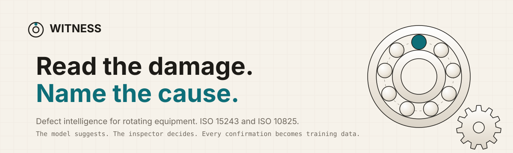
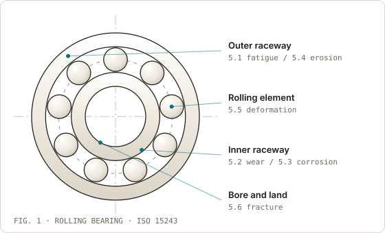
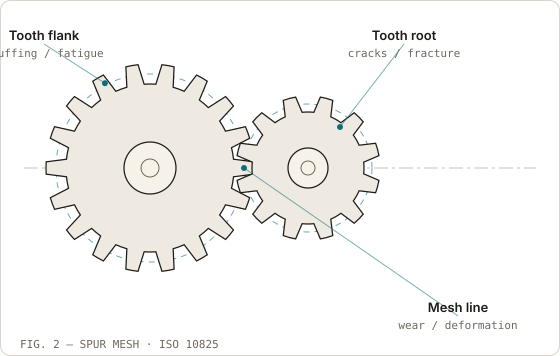
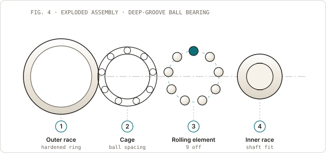
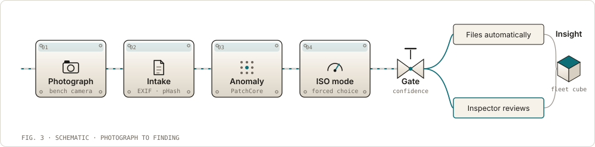
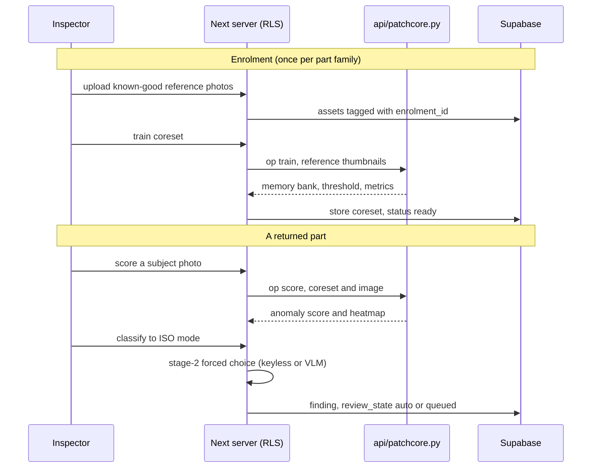
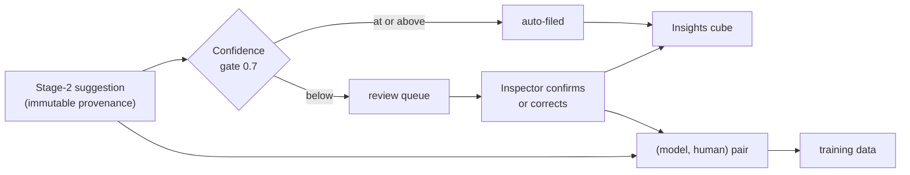

<!-- Banner generated by scripts/gen-diagrams.ts. Do not edit by hand. -->
<p align="center">
  
</p>

<p align="center">
  <a href="https://witness-kandula.vercel.app"></a>
  
  
  
  
  
  
  
</p>

# Witness

**Witness is defect intelligence for rotating equipment.** A photograph of a
returned gearbox part becomes a failure record. The record holds the damage
mode, the severity, the cause, and the batch that made the part. The model
suggests. The inspector decides. Each confirmation becomes training data.

- The model classifies **bearings** against **ISO 15243**, the standard for
  rolling-bearing damage.
- The model classifies **gears** against **ISO 10825**, the standard for
  gear-tooth wear and damage.

> **Live → [witness-kandula.vercel.app](https://witness-kandula.vercel.app)**
> Open the console. Enter the demo workspace. Walk the loop: Enrol, Score,
> Classify, Review, Insights.

Public reference pages: [About](https://witness-kandula.vercel.app/about) ·
[Taxonomy](https://witness-kandula.vercel.app/taxonomy) ·
[Transparency](https://witness-kandula.vercel.app/transparency) ·
[Model card](https://witness-kandula.vercel.app/model-card).

---

## Why Witness exists

A returned part arrives with a complaint and little else. A person photographs
it. A person writes one sentence in a spreadsheet. The part then goes in a bin.

The same damage mode appears later on a different batch, but nobody can prove it.
The first record said "worn". The second record said "pitting". Neither record
cited a standard.

The failure was never the difficult part. The record was. Witness makes the
record the product. Each record gives a damage mode with a clause number and a
severity with an action. Each record also gives a cause mechanism and a link to
the batch.

---

## The parts it reads

Witness classifies two part families. Each family has its own published
standard and its own failure catalogue. The drawings below show where the
damage appears on each part.

### Rolling bearings · ISO 15243

<p align="center">
  
</p>

ISO 15243 has six primary damage classes. The classes run from rolling-contact
fatigue to fracture and cracking. Each mode carries a clause number, such as
`5.1` or `5.6`, so the finding traces back to the document.

### Gear teeth · ISO 10825

<p align="center">
  
</p>

ISO 10825 covers wear and damage to gear teeth. The classes cover the flank,
the root, and the mesh line. They include wear, scuffing, contact fatigue,
cracks, and tooth fracture.

### The third axis, attribution

A damage mode shows what the surface looks like. An attribution names the
mechanism that caused it. Witness records both, because the fleet action
depends on the mechanism. The same pit can come from fatigue at end of life.
The same pit can also come from a contaminant dent that started it early. The
batch-level action is different in each case.

### Inside the assembly

<p align="center">
  
</p>

Witness reads the parts drawn above. The rolling elements and the two races
carry the ISO 15243 damage. The cage and the shaft seat set how the load runs
through them.

---

## The workflow

<p align="center">
  
</p>

A part photo becomes a reviewed finding in stages. Each stage does one job and
hands off. Nothing decides for itself after the confidence gate. The gate is
the one place where the software decides if a person is needed.

| Stage | Job | Where |
|-------|-----|-------|
| **0 · Intake** | Read EXIF, score provenance, and hash to find a duplicate | `POST /api/ingest`, `src/lib/phash.ts`, `src/lib/provenance.ts` |
| **0 · Enrolment** | Collect a tenant's known-good reference photos per part family | `/console/enrol`, `src/lib/enrolment.ts` |
| **1 · Anomaly** | Decide if the part is abnormal against the reference set | `api/patchcore.py`, `src/lib/patchcore.ts` |
| **2 · ISO choice** | Select the ISO failure mode by a forced choice | `src/lib/stage2.ts`, `POST /api/classify` |
| **2 · Gate** | File a high-confidence record; queue a low-confidence record | `src/lib/stage2.ts` (`CONFIDENCE_GATE`) |
| **Review** | An inspector confirms or corrects the record | `/console/review` |
| **Insights** | Show the fleet cube: ISO mode, severity, and attribution | `/console/insights`, `src/lib/buckets.ts` |
| **Provenance** | Link the batch and supplier; make the warranty report | `/console/batches`, `/report/[id]`, `/api/export/findings` |

---

## Architecture

Witness is multi-tenant on Supabase. Supabase gives Postgres, row-level
security, and authentication. The Next.js app owns all database input and
output under the signed-in tenant's session. The anomaly model runs as a
stateless Python function. The function never touches the database.


**Two colour regimes, one product.** The public pages use the warm paper "Works"
palette. The console uses an **ISA-101 High Performance HMI** discipline. The
console ground is near-neutral. The console reserves saturated colour to mean
*abnormal*. Severity never rides on colour alone. Each chip pairs a hue with a
glyph (`○◔◑◕●`) and a fill, so the signal survives colour-vision deficiency and
a greyscale print. The interface is light mode only.

### Enrol, score, classify, gate



### The label loop



The inspector's decision overrides the model. The fleet analytics and the
warranty reports use the inspector's decision. The system keeps the model
output beside the human decision and never changes it. A disputed
classification is therefore auditable.

---

## Design invariants

These rules hold on every page and in every record. Each rule has one place that
enforces it, so the rule cannot drift.

| Invariant | Enforcement |
|-----------|-------------|
| Severity never rides on hue alone | Every chip pairs a hue with a glyph (`○◔◑◕●`) and a numeral (`src/components/severity-chip.tsx`) |
| The model never overwrites the human call | The system stores the (model, human) pair and keeps the suggestion immutable |
| Stage 2 cannot invent a code | A forced choice against the part family's ISO catalogue; an off-list code is discarded (`src/lib/stage2.ts`) |
| One tenant cannot read another's rows | Postgres row-level security scopes every row to the signed-in tenant |
| The anomaly function holds no database credentials | It runs stateless: feature vectors in, a score out (`api/patchcore.py`) |
| An unsure record stays unconfirmed | The confidence gate has a visible threshold; low confidence queues for review |
| The interface is light mode only | `color-scheme: light`; there is no dark theme to keep in contrast parity |
| No runtime font CDN | `next/font` self-hosts every face at build time; all faces are OFL |
| The drawings cannot disagree with the app | One geometry module (`src/lib/mech.ts`) feeds both the live SVG and the README figures |
| The structured data cannot disagree with the page | The taxonomy JSON-LD is built from `src/lib/iso.ts`, the same array that renders the table |

---

## Honest notes

- **Stage 1 is a memory bank, not a deep model.** It has the shape of PatchCore.
  It holds a memory bank of normal patch features. It scores a new part by the
  nearest-neighbour distance. It uses cheap local patch statistics in place of a
  large backbone, because torch does not fit the size limit of a serverless
  function. The system calibrates the threshold with a leave-one-image-out
  method. `THRESH_MARGIN` is the tunable control.
- **Stage 2 forces a choice.** It must return one code from the part family's
  ISO catalogue. The system discards an invented code. Stage 2 is keyless by
  default and uses a deterministic heuristic. It routes to a vision model through
  OpenRouter when you set `OPENROUTER_API_KEY`. The confidence gate decides where
  a finding lands, not the source.
- **There is no synthetic defect data.** The reference sets are the tenant's own
  photographs of good parts. The bundled dataset registry admits only licences
  that are clean for redistribution.
- **EfficientAD is out of scope** on MVTec patent grounds. See the
  [model card](https://witness-kandula.vercel.app/model-card).

---

## Pages

| Route | Content |
|-------|---------|
| `/` | Landing: objectives, workflow, standards, severity, features |
| `/about` | What the product is, who it serves, how the detector works, the limits |
| `/taxonomy` | The full ISO 15243 and ISO 10825 catalogue, severity, attribution |
| `/transparency` | What is live, what is optional, what is not built |
| `/model-card` | The model, its data, its limits, its exclusions |
| `/console` | Findings, severity distribution, top modes, JSON export |
| `/console/enrol` | Part families, reference sets, train coreset, score a subject |
| `/console/review` | The low-confidence queue: confirm or correct |
| `/console/insights` | The 3-axis cube: mode, severity, attribution |
| `/console/batches` | Batches and suppliers, findings per lot |
| `/console/findings/[id]` | Inspection detail, ISO trace, batch link, warranty report |
| `/report/[id]` | A print-ready warranty document |

---

## The JSON API

Every route runs on the Node runtime, because `sharp` is a native module. Each
route is auth-gated and row-level-security scoped, so a caller only ever reads
or writes its own workspace.

| Route | Method | Job |
|-------|--------|-----|
| `/api/ingest` | `POST` | A photo becomes an asset row with its EXIF, a provenance score, and a perceptual hash checked against the tenant's other assets for a re-sent duplicate |
| `/api/score` | `POST` | Score one subject image against an enrolment's trained coreset. Stage 1 only: an anomaly score and a heat map |
| `/api/classify` | `POST` | The stage-2 forced choice, then the confidence gate. A confident record auto-files; anything below the gate lands in the review queue |
| `/api/records` | `GET`, `POST` | The local demo path: list records, or post an image to run the whole loop in one call |
| `/api/records/[id]/review` | `POST` | The inspector's determination. It overrides the model and becomes authoritative |
| `/api/batches` | `GET`, `POST` | List batches with their worst severity, or upsert a batch's provenance: line, produced-on date, supplier notes |
| `/api/export/findings` | `GET` | Machine-readable findings for a warranty system or a BI tool. The crop data URIs are dropped to keep the payload lean |
| `/api/export/labels` | `GET` | The training manifest: every confirmed record as a (model suggestion, human label) pair |

---

## Discovery

The public pages carry the structured data an engine needs to cite one clause
rather than a whole page.

| Surface | What it declares |
|---------|------------------|
| `/sitemap.xml`, `/robots.txt` | The five public pages. The console, the sign-in page, and the per-tenant reports are disallowed |
| `/llms.txt` | The answer-engine brief: what the system is, the facts worth quoting exactly, and which routes are private |
| `/taxonomy` | Three `DefinedTermSet` graphs built from `src/lib/iso.ts`, so the structured data cannot drift from the table on the page |
| `/transparency` | A `FAQPage` whose answers are the page's own visible prose |
| `/model-card` | A `TechArticle` and the `SoftwareSourceCode` record for this repository |
| `/`, `/about` | `SoftwareApplication` and `Person`, joined by `@id` across every page |

One module, `src/lib/seo.tsx`, holds the canonical origin, the per-page metadata
shape, and every structured-data builder.

---

## Stack

| Layer | Choice | Why |
|-------|--------|-----|
| Framework | Next.js 16 (App Router, Turbopack) | Server components read the database at request time |
| UI | React 19, Tailwind v4 | Self-hosted OFL fonts, no runtime CDN |
| Backend | Supabase (Postgres, RLS, Auth) | Multi-tenant with row-level isolation; anon and magic-link sign-in |
| Anomaly | Python function (`numpy`, `pillow`) | A PatchCore-style memory bank with no torch; it fits the serverless limit |
| Vision model | OpenRouter (optional) | The ISO forced choice; a keyless fallback runs when there is no key |
| Images | `sharp`, `exifr` | Native decode, EXIF, thumbnails, perceptual hash |
| Validation | `zod` v4 | One schema guards the local record path |
| Local database | PGlite (`@electric-sql/pglite`) | An in-process Postgres for the keyless local demo |
| Typography | Metamorphous, Cabin, Jost, JetBrains Mono, Fraunces | All OFL, all self-hosted by `next/font` at build time |

---

## Run it

```bash
npm install
npm run dev            # http://localhost:3000
npm run build && npm start
```

### Check it

```bash
npm run lint           # eslint
npm run typecheck      # tsc --noEmit
npm test               # end-to-end smoke against a running server on :3000
```

`npm test` posts a synthesised image, reads the record back, upserts the batch,
overrides the classification as an inspector would, and pulls the label export.
It needs a server on port 3000 and no environment variables: with none set the
app runs the keyless PGlite demo. CI runs the same command against the built
app on every push.

With **no environment variables**, the app runs the local PGlite demo. The demo
seeds records and uses the heuristic classifier. To run the full Supabase system
on your machine, set these variables:

```bash
NEXT_PUBLIC_SUPABASE_URL=...        # your project URL
NEXT_PUBLIC_SUPABASE_ANON_KEY=...   # the publishable anon key
# optional: turn on the real vision model for stage 2:
OPENROUTER_API_KEY=...              # a server-side secret, never NEXT_PUBLIC
OPENROUTER_MODEL=openai/gpt-4o-mini # any vision-capable model
```

The `NEXT_PUBLIC_*` values bake in at build time. Rebuild the app after you
change them.

### Build the diagrams

The README figures are generated, not hand-drawn. To rebuild them after a change
to `src/lib/mech.ts`, run one command:

```bash
npm run diagrams       # node scripts/gen-diagrams.ts
```

The command writes the banner and the three figures to `docs/assets/`. The same
geometry feeds the live components in `src/components/mechanical.tsx`, so the
static files and the app cannot disagree on the drawing.

---

## Deployment

Witness is live on Vercel. It auto-deploys from `master`:
**[witness-kandula.vercel.app](https://witness-kandula.vercel.app)**.

- The Next app and the root `api/patchcore.py` function deploy together as one
  project. Vercel serves the Python file as its own function.
- Supabase holds the `witness` schema. The schema is RLS-fenced and
  tenant-isolated. The schema must be in the project's exposed schemas, so
  PostgREST can reach it.
- `OPENROUTER_API_KEY` is a server-side variable that you set in Vercel. It is
  never committed. Without it, stage 2 runs keyless.

---

## Roadmap

- [x] Repository hygiene, CI, dataset-licence gate
- [x] Supabase backend: schema, RLS, auth, per-tenant bootstrap
- [x] Intake: EXIF, provenance score, perceptual-hash dedupe
- [x] The 3-axis bucket engine (mode, severity, attribution)
- [x] Enrolment: known-good reference sets per part family
- [x] Stage 1 anomaly: a PatchCore-style memory bank (Python function)
- [x] Stage 2 ISO forced choice, confidence gate, review queue (keyless and VLM)
- [x] Inspection view, dashboards, batch and supplier linking
- [x] Exports: warranty report, JSON API
- [x] Public about, taxonomy, transparency, and model-card pages
- [ ] A **trained, diagnostic** stage-1 backbone. This is blocked on labelled
  data, which the review loop collects.

The design system and the structure are in `docs/witness-slice-report.md`.
