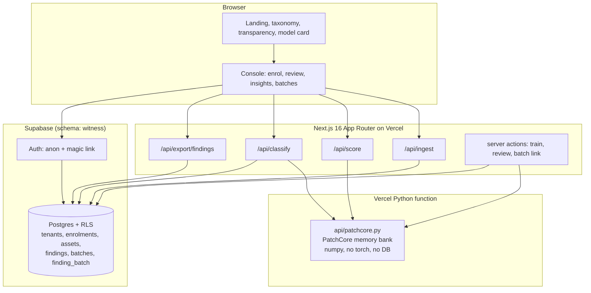
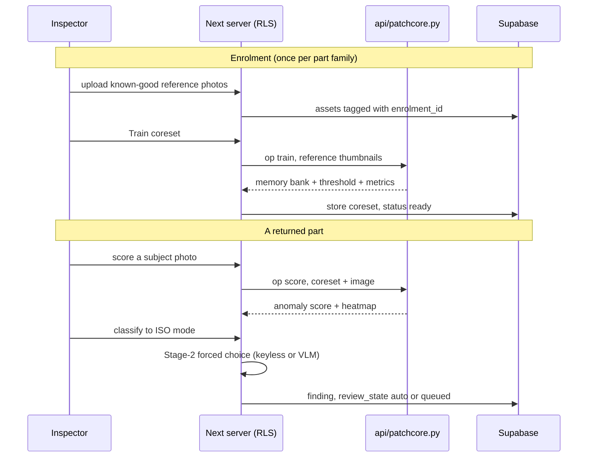
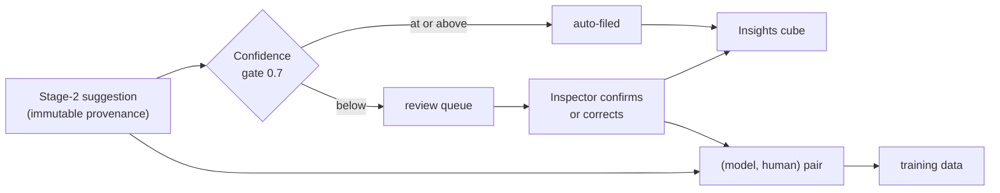

# Witness

**Defect intelligence for rotating equipment.** A photograph of a returned
gearbox part becomes a standards-linked failure record — the failure mode, the
severity, the root cause, and the batch that produced it. The model suggests;
the inspector decides; every confirmation becomes training data.

> **Live → [witness-kandula.vercel.app](https://witness-kandula.vercel.app)**
> Open the console, enter the demo workspace, and walk Enrol → Score → Classify → Review → Insights.

- **Bearings** classify against **ISO 15243** (rolling-bearing damage modes).
- **Gears** classify against **ISO 10825** (gear-tooth wear and damage).

Public reference: [Taxonomy](https://witness-kandula.vercel.app/taxonomy) ·
[Transparency](https://witness-kandula.vercel.app/transparency) ·
[Model card](https://witness-kandula.vercel.app/model-card).

---

## The pipeline

A part photo is turned into a reviewed, standards-linked finding in stages. Each
stage does one job and hands off; nothing auto-decides past the confidence gate.

| Stage | Job | Where |
|-------|-----|-------|
| **0 · Intake** | EXIF read, provenance score, perceptual-hash dedupe against the workspace | `POST /api/ingest`, `src/lib/phash.ts`, `src/lib/provenance.ts` |
| **0 · Enrolment** | Collect a tenant's known-good reference photos per part family | `/console/enrol`, `src/lib/enrolment.ts` |
| **1 · Anomaly** | Is this part abnormal vs the reference set? PatchCore-style memory bank | `api/patchcore.py`, `src/lib/patchcore.ts` |
| **2 · ISO forced-choice** | Which ISO failure mode is it? Keyless heuristic or a VLM | `src/lib/stage2.ts`, `POST /api/classify` |
| **2 · Confidence gate** | High confidence auto-files; low confidence queues for a human | `src/lib/stage2.ts` (`CONFIDENCE_GATE`) |
| **Review** | Inspector confirms or corrects — the authoritative call | `/console/review` |
| **Insights** | Fleet cube: ISO mode × severity × attribution | `/console/insights`, `src/lib/buckets.ts` |
| **Provenance** | Batch / supplier linking, warranty report, JSON export | `/console/batches`, `/report/[id]`, `/api/export/findings` |

---

## Architecture

Multi-tenant on Supabase (Postgres + row-level security + auth). The Next.js app
owns all database I/O under the signed-in tenant's session; the anomaly model
runs as a stateless Python function that never touches the database.



**Two colour regimes, one product.** The public pages run the full "Foundry"
palette; the console runs an **ISA-101 High Performance HMI** discipline —
low-saturation ground, saturated colour reserved to mean *abnormal*. Severity
never rides on hue alone: every chip pairs hue with a glyph (`○◔◑◕●`) and a fill,
so it survives deuteranopia and greyscale print.

### Enrol, score, classify, gate



### The label loop — why review exists



The inspector's determination overrides the model and is what the fleet
analytics and warranty reports use. The model output is retained immutably
beside the human decision, so a disputed classification is auditable.

---

## Honest notes

- **Stage-1 is a memory bank, not a deep model.** It is PatchCore's shape — a
  memory bank of normal patch features scored by nearest-neighbour distance — but
  with cheap local patch statistics instead of a timm backbone, because torch
  does not fit a serverless function's size limit. The threshold is calibrated
  leave-one-image-out; `THRESH_MARGIN` is the tunable knob.
- **Stage-2 forces a choice.** It must return one code from the part family's
  ISO catalog; a hallucinated code is discarded. Keyless by default (deterministic
  heuristic); routes to a vision model through OpenRouter when `OPENROUTER_API_KEY`
  is set. The confidence gate, not the source, decides where a finding lands.
- **No synthetic defect data.** Reference sets are the tenant's own photographs of
  good parts. The bundled dataset registry admits only redistribution-clean
  licences.
- **EfficientAD is deliberately excluded** on MVTec patent grounds. See the
  [model card](https://witness-kandula.vercel.app/model-card).

---

## Console

| Route | What |
|-------|------|
| `/console` | Findings, severity distribution, top modes, JSON export |
| `/console/enrol` | Part families, reference sets, train coreset, score a subject |
| `/console/review` | Low-confidence queue — confirm or correct |
| `/console/insights` | 3-axis cube: mode × severity × attribution, filterable |
| `/console/batches` | Batches and suppliers, findings per lot |
| `/console/findings/[id]` | Inspection detail, ISO trace, batch link, warranty report |
| `/report/[id]` | Print-ready warranty document (Save as PDF) |

---

## Stack

| Layer | Choice | Why |
|-------|--------|-----|
| Framework | Next.js 16 (App Router, Turbopack) | Server components read the DB at request time |
| UI | React 19 · Tailwind v4 | Self-hosted OFL fonts, no runtime CDN |
| Backend | Supabase (Postgres, RLS, Auth) | Multi-tenant with row-level isolation; anon + magic-link sign-in |
| Anomaly | Python function (`numpy`, `pillow`) | PatchCore-style memory bank, no torch — fits serverless |
| VLM | OpenRouter (optional) | ISO forced-choice; keyless fallback when no key |
| Images | `sharp` · `exifr` | Native decode, EXIF, thumbnails, perceptual hash |
| Validation | `zod` v4 | One schema guards the local record path |
| Local DB | PGlite (`@electric-sql/pglite`) | In-process Postgres for the keyless local demo |

---

## Run locally

```bash
npm install
npm run dev            # http://localhost:3000
npm run build && npm start
```

With **no environment**, the app runs the local PGlite demo (seeded records, the
heuristic classifier). To run the full Supabase system locally, set:

```bash
NEXT_PUBLIC_SUPABASE_URL=...        # your project URL
NEXT_PUBLIC_SUPABASE_ANON_KEY=...   # publishable anon key
# optional — activate the real VLM for Stage-2:
OPENROUTER_API_KEY=...              # server-side secret, never NEXT_PUBLIC
OPENROUTER_MODEL=openai/gpt-4o-mini # any vision-capable model
```

`NEXT_PUBLIC_*` values bake at build time — rebuild after changing them.

---

## Deployment

Live on Vercel, auto-deployed from `master`:
**[witness-kandula.vercel.app](https://witness-kandula.vercel.app)**.

- The Next app and the root `api/patchcore.py` Python function deploy together as
  one project (Vercel serves the `.py` file as its own lambda).
- Supabase holds the `witness` schema (RLS-fenced, tenant-isolated). The schema
  must be in the project's exposed schemas for PostgREST to reach it.
- `OPENROUTER_API_KEY` is a server-side environment variable set in Vercel — it
  is never committed. Without it, Stage-2 runs keyless.

---

## Roadmap

- [x] Repo hygiene, CI, dataset-licence gate
- [x] Supabase backend: schema, RLS, auth, per-tenant bootstrap
- [x] Intake: EXIF, provenance score, perceptual-hash dedupe
- [x] 3-axis bucket engine (mode × severity × attribution)
- [x] Enrolment: known-good reference sets per part family
- [x] Stage-1 anomaly: PatchCore-style memory bank (Python function)
- [x] Stage-2 ISO forced-choice, confidence gate, review queue (keyless + VLM)
- [x] Inspection view, dashboards, batch / supplier linking
- [x] Exports: warranty report, JSON API
- [x] Public taxonomy, transparency, and model-card pages
- [ ] A **trained, diagnostic** Stage-1 backbone (blocked on labelled data — which the review loop collects)

Design system and structure: `docs/witness-slice-report.md`.
