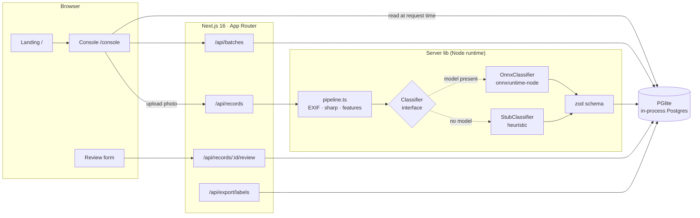
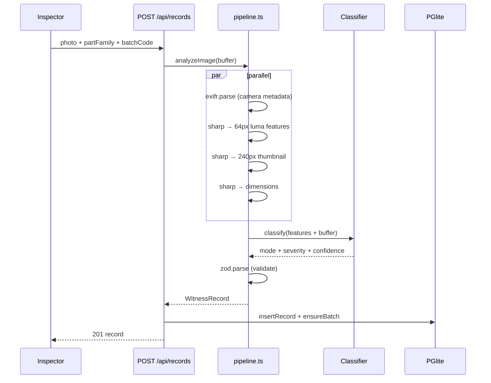
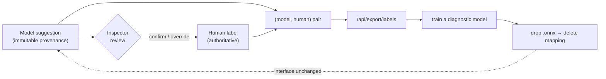

# Witness

**Defect intelligence for rotating equipment.** A photograph of a returned
gearbox part becomes a standards-linked failure record — the failure mode, the
severity, and the batch that produced it. The model suggests; the inspector
decides; every confirmation becomes training data.

> **Live demo → [witness-kandula.vercel.app](https://witness-kandula.vercel.app)**
> Open the console — the deployment seeds demo records so every view is populated.

- **Bearings** classify against **ISO 15243** (rolling-bearing damage modes).
- **Gears** classify against **ISO 10825** (gear-tooth wear and damage).

---

## What it does

| Capability | Where |
|------------|-------|
| Ingest a part photo → EXIF + features → classify → validated record | `src/lib/pipeline.ts` |
| ISO failure-mode catalogs + 0–4 severity ramp | `src/lib/iso.ts` |
| Swappable classifier — heuristic stub **or** real ONNX inference | `src/lib/classifier.ts`, `src/lib/onnx-classifier.ts` |
| In-process Postgres (PGlite), persisted locally | `src/lib/db.ts` |
| Human review — inspector confirms/overrides; the label wins | `src/app/api/records/[id]/review` |
| Batch provenance + worst-severity rollups | `/console/batches` |
| Filter & search records (part, severity, free text) | `/console` |
| Training-label export — every `(model, human)` pair | `/api/export/labels` |

---

## Architecture



**Two colour regimes, one product.** The marketing page runs the full "Foundry"
palette; the console runs an **ISA-101 High Performance HMI** discipline —
low-saturation ground, saturated colour reserved to mean *abnormal*. Severity
never rides on hue alone: every chip pairs hue with a glyph (`○◔◑◕●`) and a
fill, so it survives deuteranopia and greyscale print.

### The ingest pipeline



### The label loop — why review exists



The classifier is a **prototype, not diagnostic**. The ONNX path runs real
`onnxruntime-node` inference with a generic ImageNet model (MobileNetV2-7); the
inference is real but the ImageNet class is mapped to an ISO mode as a
**placeholder**. The inspector's judgment is the source of truth, and each
confirmed record is the training data that turns the placeholder into a real
model — without changing the `Classifier` interface.

---

## Stack

| Layer | Choice | Why |
|-------|--------|-----|
| Framework | Next.js 16.3.4 (App Router, Turbopack) | Server components read the DB at request time |
| UI | React 19 · Tailwind v4 | Self-hosted OFL fonts, no runtime CDN |
| Database | PGlite (`@electric-sql/pglite`) | Postgres in-process — no server to provision |
| Images | `sharp` · `exifr` | Native decode, EXIF, thumbnails, luma features |
| Inference | `onnxruntime-node` (optional) | Real model path, loaded only when a `.onnx` exists |
| Validation | `zod` v4 | One schema guards every record |

---

## Run locally

```bash
npm install
npm run dev            # webpack — reliable on Windows
# npm run dev:turbo    # Turbopack (dev PostCSS worker panics on some Windows setups)
npm run build && npm start
```

Open <http://localhost:3000> → **Open console**.

Optional — enable real ONNX inference (14 MB model, git-ignored):

```bash
mkdir -p data/models && curl -sL -o data/models/model.onnx \
  https://github.com/onnx/models/raw/main/validated/vision/classification/mobilenet/model/mobilenetv2-7.onnx
```

Without a model file the pipeline falls back to the stub. Override the path with
`WITNESS_ONNX_MODEL`.

---

## Deployment

Live on Vercel: **[witness-kandula.vercel.app](https://witness-kandula.vercel.app)**,
auto-deployed from `master`.

Serverless filesystems are read-only outside `/tmp` and instances are ephemeral,
so on Vercel (`process.env.VERCEL`) PGlite runs **in-memory** and `src/lib/seed.ts`
populates demo records on cold boot — the deployed preview is a self-contained
demo, not the system of record. A local install persists its own data under
`./data/witness`. Set `WITNESS_DATA_DIR` to override either path.

---

## Verify

```bash
npm run build          # typecheck + bundle
npm start &            # production server on :3000
node scripts/smoke.mjs # ingest → review → export → pages, end to end
```

Set `EXPECT_ONNX=1` to assert the ONNX classifier is the one running.

---

## Roadmap

- [x] Ingest → classify → validate → store pipeline
- [x] ISO 15243 / ISO 10825 catalogs + severity ramp
- [x] Console: records, filter/search, detail, batches, rollups
- [x] Human review loop + training-label export
- [x] Real ONNX inference path (placeholder labels)
- [x] Vercel deployment with seeded demo
- [ ] A **trained, diagnostic** model (blocked on labelled data — which the review loop collects)
- [ ] Auth, multi-workstation sync

Design system, verification results, and structure: `docs/witness-slice-report.md`.
